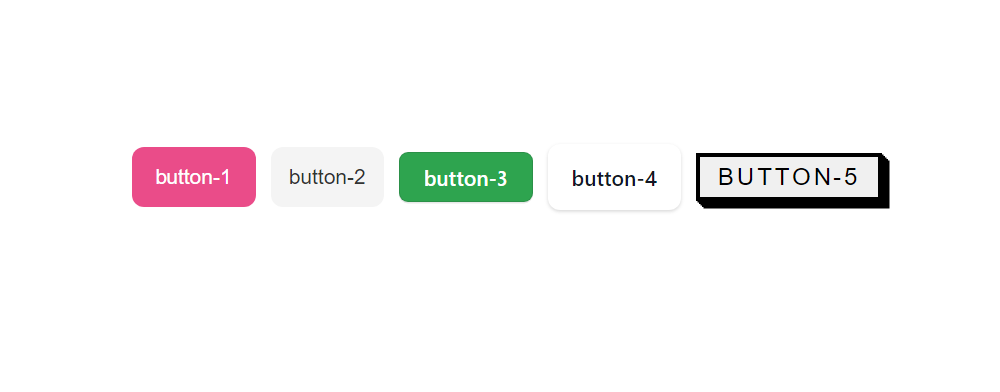

# yvnvsui

> Made with create-react-library

[](https://www.npmjs.com/package/yvnvsui) [](https://standardjs.com)

## Install

```bash
npm install --save yvnvsui
```

## Buttons



## Usage

```jsx
import React, { Component } from 'react'

import MyComponent from 'yvnvsui'
import 'yvnvsui/dist/index.css'

class Example extends Component {
  render() {
    return (
      <>
        <Button type='button-1' text='example' />
        <Button type='button-2' text='example' />
        <Button type='button-3' text='example' />
        <Button type='button-4' text='example' />
        <Button type='button-5' text='example' />
      </>
    )
  }
}
```

## License

MIT © [yvnvs](https://github.com/yvnvs)
